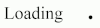
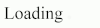

# Animated-Ellipsis #



Animated-Ellipsis is used to indicate that an action is being executed, nicely combined with a tip sentence.

## Install ##

```sh
npm install animated-ellipsis
```

## Usage ##

* Put an element on the page with empty children.
* Call `animateEllipsis` on the element.

That's it. An animated ellipsis will be displayed on the element.

## Example ##

```html
<div>
    Loading<span class="ae"></span>
</div>
```

```js
document.querySelector( '.ae' ).animateEllipsis();
```



## License ##

MIT. See [LICENSE.md](http://github.com/szchenghuang/animated-ellipsis/blob/master/LICENSE.md) for details.
