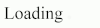

# Animated-Ellipsis #


Animated-Ellipsis is used to indicate that an action is being executed, nicely combined with a tip sentence.

## Install ##

```sh
npm install animated-ellipsis
```

or

```js
<script src="https://cdn.rawgit.com/szchenghuang/animated-ellipsis/master/src/index.js"></script>
```

## Usage ##

* Put an element on the page with empty children.
* Call `animateEllipsis` on the element.

That's it. An animated ellipsis will be displayed on the element.

## Configuration ##

There are some settings you can tweak by setting data attributes on the element.

```html
<span class="ae" data-font-size="2rem" data-margin-left="0.1rem" data-spacing="0.1rem"></span>
```

* data-font-size: The font size of dots. Default: `2rem`.
* data-margin-left: The spacing between the sibling text and the first dot. The value is set to `margin-left` of the first dot. Default: `0.1rem`.
* data-spacing: The spacing between dots. The value is set to `margin-left` of the second and third dots. Default: `0.1rem`.

## Example ##

```html
<div>
    Loading<span class="ae"></span>
</div>
```

```js
// Import first.
require( 'animated-ellipsis' );

// Animate it.
document.querySelector( '.ae' ).animateEllipsis();
```



## License ##

MIT. See [LICENSE.md](http://github.com/szchenghuang/animated-ellipsis/blob/master/LICENSE.md) for details.
